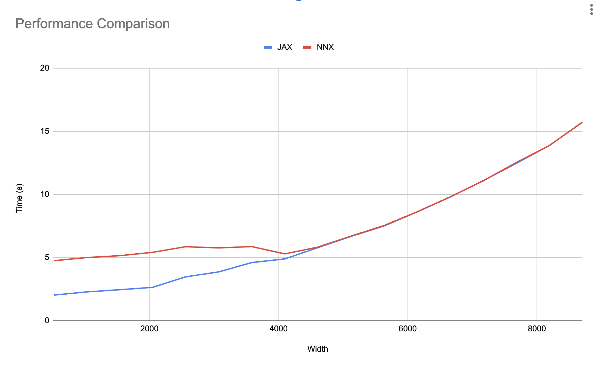

---
jupytext:
  formats: ipynb,md:myst
  text_representation:
    extension: .md
    format_name: myst
    format_version: 0.13
    jupytext_version: 1.13.8
---

# Performance considerations

Currently, Flax [`nnx.jit`](https://flax.readthedocs.io/en/latest/api_reference/flax.nnx/transforms.html#flax.nnx.jit) traverses the object graph in pure Python which can add overhead. This overhead mostly affects small to medium models and can be mitigated in the following ways:
* By leveraging JAX's [Asynchronous dispatch](#asynchronous-dispatch).
* By using [nnx.cache_args](#caching-graph-node-traversals) to cache the graph node traversals.
* By using a [Functional training loop](#functional-training-loop) which stages out the graph traversals.

A full resolution _might_ involve developing a C extension (e.g. `flaxlib`) to speed up some of the traversal logic in [`graph.py`](https://github.com/google/flax/blob/main/flax/nnx/graph.py). Before we continue lets an example of a model and a simple training loop:

```{code-cell}
from flax import nnx
import jax
import jax.numpy as jnp
import optax

class Model(nnx.Module):
  def __init__(self, din, dmid, dout, rngs: nnx.Rngs):
    self.linear = nnx.Linear(din, dmid, rngs=rngs)
    self.bn = nnx.BatchNorm(dmid, rngs=rngs)
    self.dropout = nnx.Dropout(0.2, rngs=rngs)
    self.linear_out = nnx.Linear(dmid, dout, rngs=rngs)

  def __call__(self, x):
    x = nnx.relu(self.dropout(self.bn(self.linear(x))))
    return self.linear_out(x)
  
model = Model(2, 64, 3, rngs=nnx.Rngs(0))  # eager initialization
optimizer = nnx.Optimizer(model, optax.adam(1e-3))  # reference sharing
metrics = nnx.MultiMetric(
  loss=nnx.metrics.Average('loss'),
)

@nnx.jit  # <== currently slow
def train_step(model, optimizer, metrics, x, y):
  def loss_fn(model):
    y_pred = model(x)  # call methods directly
    return ((y_pred - y) ** 2).mean()

  loss, grads = nnx.value_and_grad(loss_fn)(model)
  optimizer.update(grads)  # in-place updates
  metrics.update(loss=loss)

  return loss
  
for _ in range(10):
  x, y = jnp.ones((32, 2)), jnp.zeros((32, 3))
  loss = train_step(model, optimizer, metrics, x, y)
```

Important thing here is that we created a `train_step()` function that uses `nnx.jit` and takes in a `model`, `optimizer`, and `metrics` arguments, all of which are Flax NNX objects. We'll later see how to improve this.

+++

## Asynchronous dispatch

Asynchronous dispatch is a feature of JAX where it runs operations in the background whenever possible so Python can continue executing other code. This can be use to absorve the cost of data loading and in this case the overhead of `nnx.jit` and similar transforms. In general, as the amount of computation JAX has to perform per iteration increases the more it is able to absorve the python overhead since eventually the JAX computation will be the main blocker and programs with different overhead will have the same performance. This could be achieved in a couple of ways:

* Increasing the batch size.
* Increasing the model size.
* Performing more JAX steps per python step if data loading is fast enough.

To demonstrate this, the graph below which shows total time of running [benchmarks/nnx_simple_training.py](https://github.com/google/flax/blob/main/benchmarks/nnx_simple_training.py) for both `jax.jit` and `nnx.jit` with different model sizes:



As we can observe, after a certain model size both `jax.jit` and `nnx.jit` converge to the same runtime cost. This means we don't have to modify our training loop above.

## Caching graph node traversals

The simplest way to get rid of the traversal overhead entirely is by using `nnx.cache_args` to convert a transformed function and the input graph objects into a partial function which caches the graph object and just expects the remaining arguments. In this example we use `nnx.cache_args` over `train_step` and partially apply `model`, `optimizer`, and `metrics`, to create `cached_train_step`. Then we simply update our training loop to use `cached_train_step` which only expects the `x` and `y` inputs:

```{code-cell}
cached_train_step = nnx.cached_partial(train_step, model, optimizer, metrics)

for _ in range(10):
  x, y = jnp.ones((32, 2)), jnp.zeros((32, 3))
  loss = cached_train_step(x, y)
```

Note that `cache_args` will enforce that the structure of the graph nodes doesn't change during `train_step` (no mutations except for `Variable` state update) so the cache is guaranteed to be up-to-date and we can avoid costly checks which require traversals. This is actually what is expected for most step functions as making any change here would imply costly recompilation, so enforcing this might be a secondary feature that could be useful for this purpose.

Similarly, to prevent the user from mutating the cached objects outside, `cache_args` creates a copy of all the graph nodes but, to allow state to be propagated to the original objects, they share references to the same `Variable`s.

+++

## Functional training loop

To remove the Python overhead we can create a functional training loop that uses regular `jax.jit` in combination with `nnx.split` and `nnx.merge` to stage out the traversal logic. Concretely we can use [`nnx.split`](https://flax.readthedocs.io/en/latest/api_reference/flax.nnx/graph.html#flax.nnx.split) before the training loop to create a single `graphdef` and `state` pytrees for all the graph nodes. Then we change `train_step()` to accept `graphdef` and `state`, and use [`nnx.merge`](https://flax.readthedocs.io/en/latest/api_reference/flax.nnx/graph.html#flax.nnx.merge) to recreate the objects inside, and either `nnx.split` or `nnx.state` at the end to get the output `state`. At the end of the training loop or whenever needed we can use [`nnx.update`](https://flax.readthedocs.io/en/latest/api_reference/flax.nnx/graph.html#flax.nnx.update) to update the objects to the current `state`.

```{code-cell}
# split before training loop
graphdef, state = nnx.split((model, optimizer, metrics))

@jax.jit  # regular JAX
def jax_train_step(graphdef, state, x, y):
  # merge at the beginning of the function
  model, optimizer, metrics = nnx.merge(graphdef, state)

  def loss_fn(model):
    y_pred = model(x)  # call methods directly
    return ((y_pred - y) ** 2).mean()

  loss, grads = nnx.value_and_grad(loss_fn)(model)
  optimizer.update(grads)
  metrics.update(loss=loss)

  state = nnx.state((model, optimizer, metrics))
  return loss, state

for _ in range(10):
  x, y = jnp.ones((32, 2)), jnp.zeros((32, 3))
  state, loss = jax_train_step(graphdef, state, x, y)

# update objects after training
nnx.update((model, optimizer, metrics), state)
```

Notice that we only need to do this for `jit`, the use of other Flax transforms like [`nnx.value_and_grad`](https://flax.readthedocs.io/en/latest/api_reference/flax.nnx/transforms.html#flax.nnx.value_and_grad) inside `train_step` doesn't have any performance cost since `jit` will make sure this only traced once.
