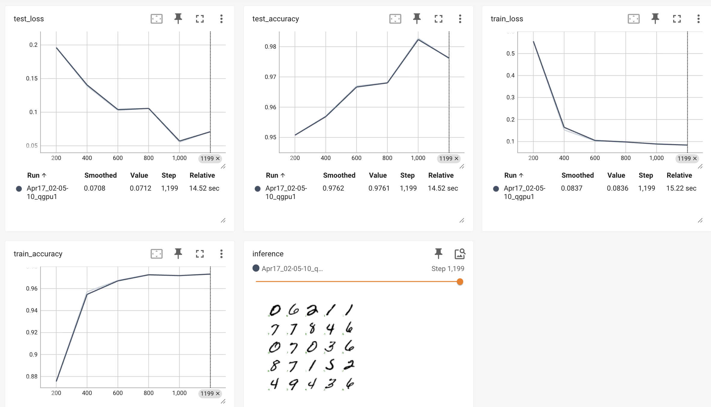

---
jupytext:
  formats: ipynb,md:myst
  main_language: python
  text_representation:
    extension: .md
    format_name: myst
    format_version: 0.13
    jupytext_version: 1.13.8
---

[](https://colab.research.google.com/github/google/flax/blob/main/docs_nnx/mnist_tutorial.ipynb)
[](https://github.com/google/flax/blob/main/docs_nnx/mnist_tutorial.ipynb)

# MNIST tutorial

Welcome to Flax NNX! In this tutorial you will learn how to build and train a simple convolutional neural network (CNN) to classify handwritten digits on the MNIST dataset using the Flax NNX API.

Flax NNX is a Python neural network library built upon [JAX](https://github.com/jax-ml/jax). If you have used the Flax Linen API before, check out [Why Flax NNX](https://flax.readthedocs.io/en/latest/why.html). You should have some knowledge of the main concepts of deep learning.

Let’s get started!

## 1. Install Flax

If `flax` is not installed in your Python environment, use `pip` to install the package from PyPI (below, just uncomment the code in the cell if you are working from Google Colab/Jupyter Notebook):

```{code-cell} ipython3
# !pip install -U "jax[cuda12]"
# !pip install -U flax
```

## 2. Load the MNIST dataset

First, we need to load the MNIST dataset and prepare the training and testing sets using the Hugging Face [`datasets`](https://huggingface.co/docs/datasets) package. We'll normalize the image values and shuffle the training data. The `make_batches` helper converts the dataset into batches of NumPy arrays with a channel dimension added, dropping any incomplete final batch.

```{code-cell} ipython3
import numpy as np
import matplotlib.pyplot as plt
from datasets import load_dataset

train_steps = 1200
eval_every = 200
batch_size = 32

dataset = load_dataset('mnist')
train_ds = dataset['train'].shuffle(seed=0)
test_ds = dataset['test']

def make_batches(ds, batch_size):
  """Yield batches of normalized (image, label) numpy arrays."""
  for i in range(0, len(ds), batch_size):
    batch = ds[i : i + batch_size]
    if len(batch['label']) < batch_size:  # drop incomplete final batch
      break
    images = np.stack([
      np.array(img, dtype=np.float32)[..., None] / 255.0
      for img in batch['image']
    ])
    yield {'image': images, 'label': np.array(batch['label'])}
```

## 3. Define the model with Flax NNX

Create a CNN for classification with Flax NNX by subclassing `nnx.Module`:

```{code-cell} ipython3
from flax import nnx  # The Flax NNX API.
from functools import partial
from typing import Optional

class CNN(nnx.Module):
  """A simple CNN model."""

  def __init__(self, *, rngs: nnx.Rngs):
    self.conv1 = nnx.Conv(1, 32, kernel_size=(3, 3), rngs=rngs)
    self.batch_norm1 = nnx.BatchNorm(32, rngs=rngs)
    self.dropout1 = nnx.Dropout(rate=0.025)
    self.conv2 = nnx.Conv(32, 64, kernel_size=(3, 3), rngs=rngs)
    self.batch_norm2 = nnx.BatchNorm(64, rngs=rngs)
    self.avg_pool = partial(nnx.avg_pool, window_shape=(2, 2), strides=(2, 2))
    self.linear1 = nnx.Linear(3136, 256, rngs=rngs)
    self.dropout2 = nnx.Dropout(rate=0.025)
    self.linear2 = nnx.Linear(256, 10, rngs=rngs)

  def __call__(self, x, rngs: nnx.Rngs | None = None):
    x = self.avg_pool(nnx.relu(self.batch_norm1(self.dropout1(self.conv1(x), rngs=rngs))))
    x = self.avg_pool(nnx.relu(self.batch_norm2(self.conv2(x))))
    x = x.reshape(x.shape[0], -1)  # flatten
    x = nnx.relu(self.dropout2(self.linear1(x), rngs=rngs))
    x = self.linear2(x)
    return x

# Instantiate the model.
model = CNN(rngs=nnx.Rngs(0))
# Visualize it.
nnx.display(model)
```

### Run the model

Let's put the CNN model to the test!  Here, we’ll perform a forward pass with arbitrary data and print the results.

```{code-cell} ipython3
import jax.numpy as jnp  # JAX NumPy

y = model(jnp.ones((1, 28, 28, 1)), nnx.Rngs(0))
y
```

## 4. Create the optimizer and define some metrics

In Flax NNX, you need to create an `nnx.Optimizer` object to manage the model's parameters and apply gradients during training. `nnx.Optimizer` receives the model's reference, so that it can update its parameters, and an [Optax](https://optax.readthedocs.io/) optimizer to define the update rules. Additionally, we'll define an `nnx.MultiMetric` object to keep track of the `Accuracy` and the `Average` loss.

```{code-cell} ipython3
import optax

learning_rate = 0.005
momentum = 0.9

optimizer = nnx.Optimizer(
  model, optax.adamw(learning_rate, momentum), wrt=nnx.Param
)
metrics = nnx.MultiMetric(
  accuracy=nnx.metrics.Accuracy(),
  loss=nnx.metrics.Average('loss'),
)

nnx.display(optimizer)
```

## 5. Define training step functions

In this section, you will define a loss function using the cross entropy loss ([`optax.softmax_cross_entropy_with_integer_labels()`](https://optax.readthedocs.io/en/latest/api/losses.html#optax.softmax_cross_entropy_with_integer_labels)) that the CNN model will optimize over.

In addition to the `loss`, during training and testing you will also get the `logits`, which will be used to calculate the accuracy metric.

During training — the `train_step` — you will use `nnx.value_and_grad` to compute the gradients and update the model's parameters using the `optimizer` you have already defined. The `train_step` also receives an `nnx.Rngs` object to provide randomness for dropout. The `eval_step` omits `rngs` because the eval view already has `deterministic=True`, so dropout is disabled and no random key is needed. During both steps, the `loss` and `logits` are used to update the metrics.

```{code-cell} ipython3
def loss_fn(model: CNN, batch, rngs: nnx.Rngs | None = None):
  logits = model(batch['image'], rngs)
  loss = optax.softmax_cross_entropy_with_integer_labels(
    logits=logits, labels=batch['label']
  ).mean()
  return loss, logits

@nnx.jit
def train_step(model: CNN, optimizer: nnx.Optimizer, metrics: nnx.MultiMetric, rngs: nnx.Rngs, batch):
  """Train for a single step."""
  grad_fn = nnx.value_and_grad(loss_fn, has_aux=True)
  (loss, logits), grads = grad_fn(model, batch, rngs)
  metrics.update(loss=loss, logits=logits, labels=batch['label'])  # In-place updates.
  optimizer.update(model, grads)  # In-place updates.

@nnx.jit
def eval_step(model: CNN, metrics: nnx.MultiMetric, batch):
  loss, logits = loss_fn(model, batch)
  metrics.update(loss=loss, logits=logits, labels=batch['label'])  # In-place updates.
```

In the code above, the [`nnx.jit`](https://flax.readthedocs.io/en/latest/api_reference/flax.nnx/transforms.html#flax.nnx.jit) transformation decorator traces the `train_step` function for just-in-time compilation with [XLA](https://www.tensorflow.org/xla), optimizing performance on hardware accelerators, such as Google TPUs and GPUs. `nnx.jit` is a stateful version of the `jax.jit` transform that allows its function input and outputs to be Flax NNX objects. Similarly, `nnx.value_and_grad` is a stateful version of `jax.value_and_grad`. Check out [the transforms guide](https://flax.readthedocs.io/en/latest/guides/transforms.html) to learn more.

> **Note:** The code shows how to perform several in-place updates to the model, the optimizer, the RNG streams, and the metrics, but _state updates_ were not explicitly returned. This is because Flax NNX transformations respect _reference semantics_ for Flax NNX objects, and will propagate the state updates of the objects passed as input arguments. This is a key feature of Flax NNX that allows for a more concise and readable code. You can learn more in [Why Flax NNX](https://flax.readthedocs.io/en/latest/why.html).

## 6. Define test set inference functions

We'll also create a `jit`-compiled model inference function (with `nnx.jit`) - `pred_step` - to generate predictions on the test set using the learned model parameters. Before the training loop, we use [`nnx.view`](https://flax.readthedocs.io/en/latest/guides/view.html) to create a `train_model` (with dropout enabled and batch norm in training mode) and an `eval_model` (with dropout disabled and batch norm using running statistics). These views share the same underlying weights, so updates during training are automatically reflected during evaluation. We can use the `eval_model` for inference. This will enable us to visualize test images alongside their predicted labels for a qualitative assessment of model performance.

```{code-cell} ipython3
train_model = nnx.view(model, deterministic=False, use_running_average=False)
eval_model = nnx.view(model, deterministic=True, use_running_average=True)

@nnx.jit
def pred_step(model: CNN, batch):
  logits = model(batch['image'], None)
  return logits.argmax(axis=1)

def plot_predictions(test_batch, pred):
    fig, axs = plt.subplots(5, 5, figsize=(6, 6))
    for i, ax in enumerate(axs.flatten()):
      ax.imshow(test_batch['image'][i, ..., 0], cmap='binary')
      # ax.set_title(f'label={pred[i]}')
      color = 'green' if test_batch['label'][i] == pred[i] else 'red'
      ax.text(0.05, 0.05, str(pred[i]), transform=ax.transAxes, color=color)
      ax.axis('off')
    return fig
```

## 7. Train and evaluate the model

Now, we can train the CNN model. We'll also set up [TensorBoard](https://www.tensorflow.org/tensorboard) logging. TensorBoard is a visualization toolkit that displays interactive charts of metrics — like loss and accuracy — as training progresses, letting us monitor convergence and compare runs. We use the `tensorboardX` library, which provides a TensorBoard-compatible `SummaryWriter` interface without requiring TensorFlow as a dependency. Each call to `writer.add_scalar` records a scalar value (e.g. `train_loss`) at a given training step; TensorBoard reads these from the `runs/` directory and plots them in real time. We also use `writer.add_figure` to visualize the plots created with our `plot_predictions` function.

```{code-cell} ipython3
from tensorboardX import SummaryWriter
import tensorboard
writer = SummaryWriter()
```

You can open tensorboard in a separate browser window at `localhost:6006`, but there's also a Jupyter extension to view its progress from with a notebook

```{code-cell} ipython3
%load_ext tensorboard
```

```{code-cell} ipython3
%tensorboard --logdir runs
```



```{code-cell} ipython3
rngs = nnx.Rngs(0)

for step, batch in enumerate(make_batches(train_ds, batch_size)):
  if step >= train_steps:
    break
  # Run the optimization for one step and make a stateful update to the following:
  # - The train state's model parameters
  # - The optimizer state
  # - The training loss and accuracy batch metrics
  train_step(train_model, optimizer, metrics, rngs, batch)

  if step > 0 and (step % eval_every == 0 or step == train_steps - 1):  # Evaluation period passed.
    # Log the training metrics.
    for metric, value in metrics.compute().items():  # Compute the metrics.
      writer.add_scalar(f'train_{metric}', value, step) # Record the metrics.
    metrics.reset()  # Reset the metrics for the test set.

    # Compute the metrics on the test set after each training epoch.
    for test_batch in make_batches(test_ds, batch_size):
      eval_step(eval_model, metrics, test_batch)

    # Show predicted labels on a single test batch
    pred = pred_step(eval_model, test_batch)
    fig = plot_predictions(test_batch, pred)
    writer.add_figure('inference', fig, step)

    # Log the test metrics.
    for metric, value in metrics.compute().items():
      writer.add_scalar(f'test_{metric}', value, step) # Record the metrics.

    metrics.reset()  # Reset the metrics for the next training epoch.
```

# 8. Export the model

Flax models are great for research, but aren't meant to be deployed directly. Instead, high performance inference runtimes like LiteRT or TensorFlow Serving operate on a special [SavedModel](https://www.tensorflow.org/guide/saved_model) format. The [Orbax](https://orbax.readthedocs.io/en/latest/guides/export/orbax_export_101.html) library makes it easy to export Flax models to this format. First, we must create a `JaxModule` object wrapping a model and its prediction method.

```{code-cell} ipython3
# !pip install -U "orbax-export[all]"
from orbax.export import JaxModule, ExportManager, ServingConfig
import tensorflow as tf
```

```{code-cell} ipython3
def exported_predict(model, y):
    return model(y, None)

jax_module = JaxModule(eval_model, exported_predict)
```

We also need to tell Tensorflow Serving what input type `exported_predict` expects in its second argument. The export machinery expects type signature arguments to be PyTrees of `tf.TensorSpec`.

```{code-cell} ipython3
sig = [tf.TensorSpec(shape=(1, 28, 28, 1), dtype=tf.float32)]
```

Finally, we can bundle up the input signature and the `JaxModule` together using the `ExportManager` class.

```{code-cell} ipython3
export_mgr = ExportManager(jax_module, [
    ServingConfig('mnist_server', input_signature=sig)
])

output_dir='/tmp/mnist_export'
export_mgr.save(output_dir)
```

Congratulations! You have learned how to use Flax NNX to build and train a simple classification model end-to-end on the MNIST dataset.

Next, check out [Why Flax NNX?](https://flax.readthedocs.io/en/latest/why.html) and get started with a series of [Flax NNX Guides](https://flax.readthedocs.io/en/latest/guides/index.html).
