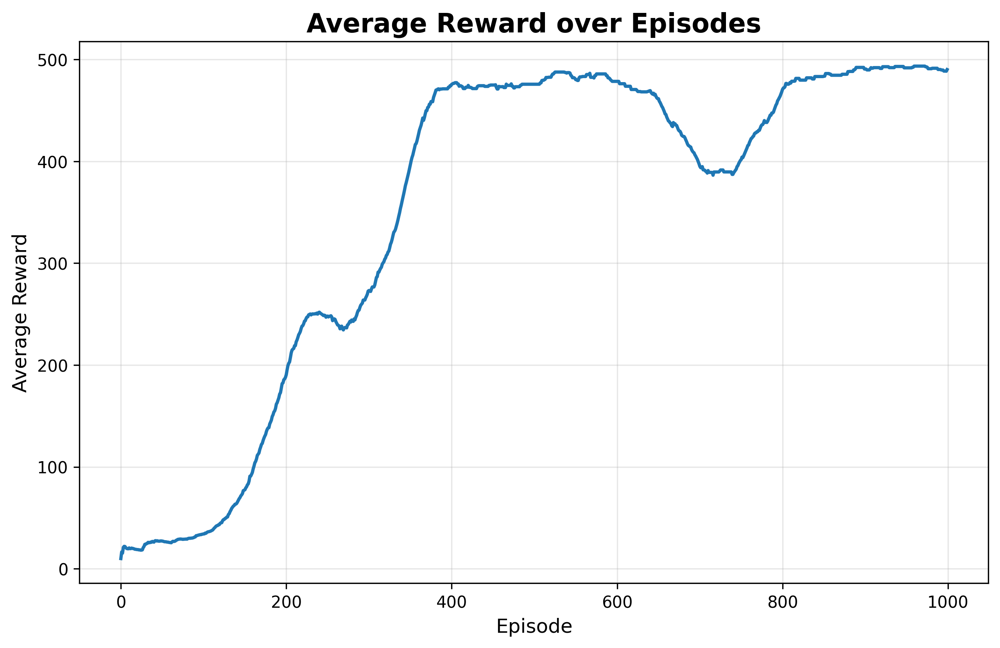
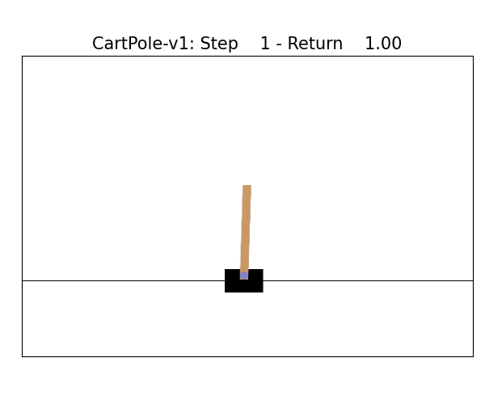

# REINFORCE Algorithm

Implementation of the REINFORCE policy gradient algorithm ([Williams, 1992](https://doi.org/10.1007/BF00992696)) for solving the CartPole-v1 environment using JAX and Flax NNX.

## Overview

This example demonstrates:
- Policy gradient learning with Monte Carlo returns
- Neural network policy using Flax NNX
- Entropy regularization for improved exploration
- JAX transformations for efficient gradient computation

The agent learns to balance a pole on a cart, achieving an average reward of 490+ (solving threshold: 475) within ~480 episodes.

## Requirements

This example requires `gymnax` for the environment and `tqdm` for progress tracking:
```bash
pip install -r requirements.txt
```

Required packages:
- `jax>=0.4.13`
- `flax==0.10.6` (NNX API)
- `optax>=0.1.7`
- `gymnax>=0.0.6`
- `tqdm>=4.65.0`
- `orbax-checkpoint>=0.4.0`

## Implementation Details

### Algorithm
- **Policy**: 3-layer MLP (128-128-2 units) with leaky ReLU activations
- **Optimization**: Adam optimizer with learning rate decay (1e-3 → decay)
- **Loss**: Policy gradient loss with entropy bonus (coefficient: 0.01)
- **Returns**: Discounted returns with gamma=0.99, normalized per episode
- **Gradient clipping**: Global norm clipping at 1.0

### Key Features
- Pure JAX/Flax implementation with JIT compilation
- Efficient episode rollouts using Gymnax
- Xavier weight initialization
- Exponential learning rate decay
- Early stopping when performance threshold is reached


## How to run

There are two implementations available in the CartPole directory:
- `simple_reinforce.ipynb`: Standard REINFORCE implementation

Each notebook includes:
- Environment setup
- Policy network definition
- Training loop
- Performance monitoring

## Training Results

The implementation tracks various metrics during training:

1. Reward Progress:


2. Trained Agent:



## References

Williams, R. J. (1992). Simple statistical gradient-following algorithms for connectionist reinforcement learning. *Machine Learning*, 8(3-4), 229-256. [DOI: 10.1007/BF00992696](https://doi.org/10.1007/BF00992696)

## Additional Resources

- [Flax NNX Documentation](https://flax.readthedocs.io/en/latest/nnx/index.html)
- [Gymnax Documentation](https://github.com/RobertTLange/gymnax)
- [Policy Gradient Methods (Sutton & Barto)](http://incompleteideas.net/book/RLbook2020.pdf)
