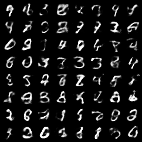

# Basic VAE Example

This is an implementation of the paper [Auto-Encoding with Variational Bayes](http://arxiv.org/abs/1312.6114) by D.P.Kingma and M.Welling.
This code follows [pytorch/examples/vae](https://github.com/pytorch/examples/blob/master/vae/README.md).

```bash
pip install -r requirements.txt
python main.py --config=configs/default.py
```

## Overriding Hyperparameter configurations

This VAE example allows specifying a hyperparameter configuration by the means of
setting `--config` flag. Configuration flag is defined using
[config_flags](https://github.com/google/ml_collections/tree/master#config-flags).
`config_flags` allows overriding configuration fields. This can be done as
follows:

```shell
python main.py \
--config=configs/default.py \
--config.learning_rate=0.01 --config.num_epochs=10
```


## Examples

If you run the code by above command, you can get some generated images:



and reconstructions of test set digits:


The test set loss after 10 epochs should be around `104`.
