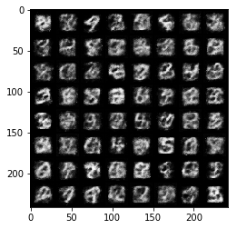
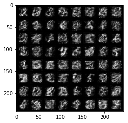
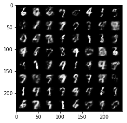
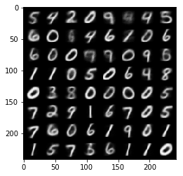
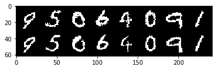
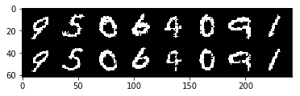
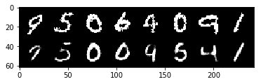
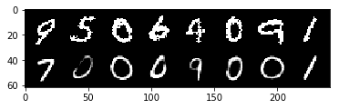

# Basic discrete VAE Example

This implementation was inspired by the papers
[Neural Discrete Representation Learning](https://arxiv.org/abs/1711.00937)
and [Fast Decoding in Sequence Models Using Discrete Latent Variables](https://arxiv.org/abs/1803.03382).

The code is inspired by the [fairseq kmeans quantizer] implementation (https://github.com/pytorch/fairseq/blob/master/fairseq/modules/kmeans_vector_quantizer.py) and by the [variational autoencoder in this repository](https://github.com/google/jax/blob/master/examples/mnist_vae.py).

```bash
pip install -r requirements.txt
python train.py
```

## Examples

If you run the code using above command, you will get some generated images:









and reconstructions of test set digitis:









The test set reconstruction loss varies from 60 to 155, depending on training settings. Pushing the number of slices improves the reconstruction capabilities, but makes generation much less interpretable. Adding the L2 commitment loss seems to improve
generation capabilities, but makes the training quite unstable - in particular decreasing of the learning rate to 1e-4 or 1e-5 seems to be mandatory.
